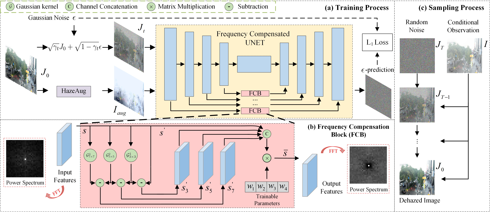
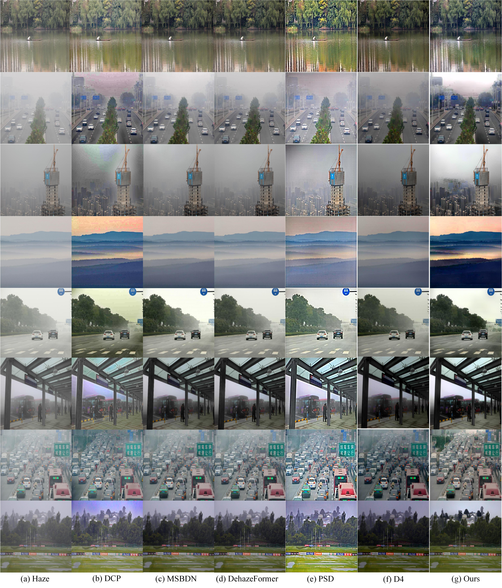

<h1 align="left">Frequency Compensated Diffusion Model for Real-scene Dehazing<a href="https://arxiv.org/abs/2308.10510">.svg" ></a> </h1> 


This is an official implementation of **Frequency Compensated Diffusion Model for Real-scene Dehazing** by **Pytorch**.



<!-- (a) The training process of the proposed dehazing diffusion model. At step $t$, the network takes an augmented hazy image $I_{aug}$ and a noisy image $J_t$ as inputs. The network architecture adopts special skip connections, i.e., the Frequency Compensation Block (FCB), for better $\epsilon$-prediction. (b) The detailed block design of FCB. The input signals of FCB are enhanced at the mid-to-high frequency band so that the output spectrum has abundant higher frequency modes. (c) The sampling process of the proposed dehazing diffusion model. -->

<!-- -   
Power spectrum analysis on $\epsilon$-prediction results of DDPMs at varying $t$.
(a) The power spectra of DDPM and DDPM+FCB.
(b) The PSD analysis of DDPM and DDPM+FCB.
(c) The KL distance between the spectrum of the predicted $\epsilon$ in (b) and that of the groundtruth. The smaller distance, the closer to groundtruth.
 -->
 
## Getting started
### Installation
* This repo is a modification on the [**SR3 Repo**](https://github.com/Janspiry/Image-Super-Resolution-via-Iterative-Refinement ).

* Install third-party libraries.

```python
pip install -r requirement.txt 
```

### Data Prepare

Download train/eval data from the following links:

Training: [*RESIDE*](https://sites.google.com/view/reside-dehaze-datasets/reside-v0)

Testing:
[*I-Haze*](https://data.vision.ee.ethz.ch/cvl/ntire18//i-haze/#:~:text=To%20overcome%20this%20issue%20we%20introduce%20I-HAZE%2C%20a,real%20haze%20produced%20by%20a%20professional%20haze%20machine.) / 
[*O-Haze*](https://data.vision.ee.ethz.ch/cvl/ntire18/o-haze/) /
[*Dense-Haze*](https://arxiv.org/abs/1904.02904#:~:text=To%20address%20this%20limitation%2C%20we%20introduce%20Dense-Haze%20-,introducing%20real%20haze%2C%20generated%20by%20professional%20haze%20machines.) /
[*Nh-Haze*](https://data.vision.ee.ethz.ch/cvl/ntire20/nh-haze/) /
[*RTTS*](https://sites.google.com/view/reside-dehaze-datasets/reside-standard?authuser=0) 

```python
mkdir dataset
```

Re-organize the train/val images in the following file structure:


```shell
 #Training data file structure
dataset/RESIDE/
├── HR # ground-truth clear images.
├── HR_hazy_src # hazy images.
└── HR_depth # depth images (Generated by MonoDepth (github.com/OniroAI/MonoDepth-PyTorch)).

#Testing data (e.g. DenseHaze) file structure
dataset/{name}/
├── HR # ground-truth images.
└── HR_hazy # hazy images.
```

then make sure the correct data paths ("dataroot") in config/framework_da.json.

## Pretrained Model

We prepared the pretrained model at:

| Type                                                        | Weights                                        |
| ----------------------------------------------------------- | ------------------------------------------------------------ |
| Generator                                                 | [OneDrive](https://1drv.ms/u/s!AsqtTP8eWS-penA8AqrU8c_I4jU) |

## Evaluation

Download the test set (e.g O-Haze). Simply put the test images in "dataroot" and set the correct path in config/framework_da.json about "dataroot";

Download the pretrained model and set the correct path in config/framework_da.json about "resume_state":

```json
    "path": {
      "log": "logs",
      "tb_logger": "tb_logger",
      "results": "results",
      "checkpoint": "checkpoint",
      "resume_state": "./ddpm_fcb_230221_121802"
    }
    "val": {
      "name": "dehaze_val",
      "mode": "LRHR",
      "dataroot": "dataset/O-HAZE-PROCESS",
      ...
    }
```


```python
# infer
python infer.py -c [config file]
```

The default config file is config/framework_da.json. The outputs images are located at /data/diffusion/results. One can change output path in core/logger.py.

### Train

Prepare train dataset and set the correct paths in config/framework_da.json about "datasets";

If training from scratch, make sure "resume_state" is null in config/framework_da.json.

```python
# infer
python train.py -c [config file]
```

## Results
Quantitative comparison on real-world hazy data (RTTS). Bold and underline indicate the best and the second-best, respectively.
<p align="center">
  
</p>

## Todo


- [x] Upload configs and pretrained models

- [x] Upload evaluation scripts

- [x] Upload train scripts
